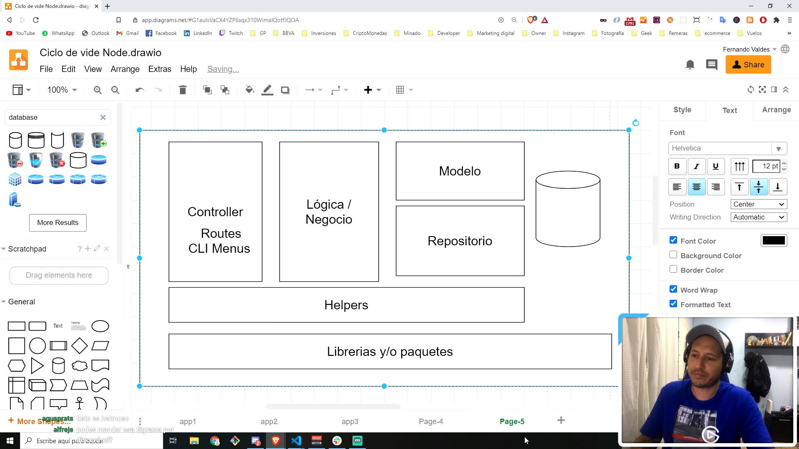

* se instala npm install uuid para generar 'id' sin repetirse
* se instala inquirer : https://www.npmjs.com/package/inquirer
    * $ npm install inquierer
* se instala npm colors.
* se modifica el listado de GetTask para mostrar sólo las tareas y no el objeto completo.

* Diagrama de Capas de la app :

